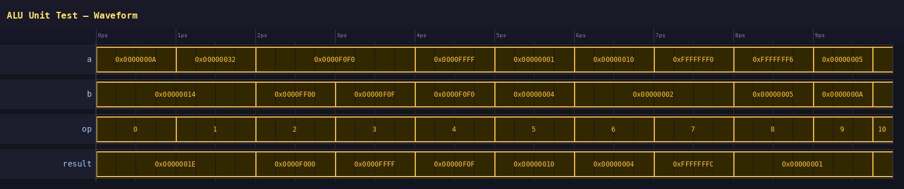
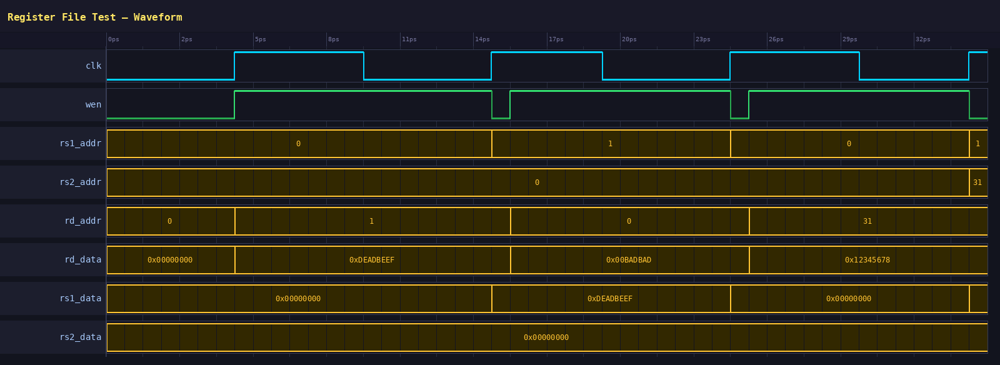
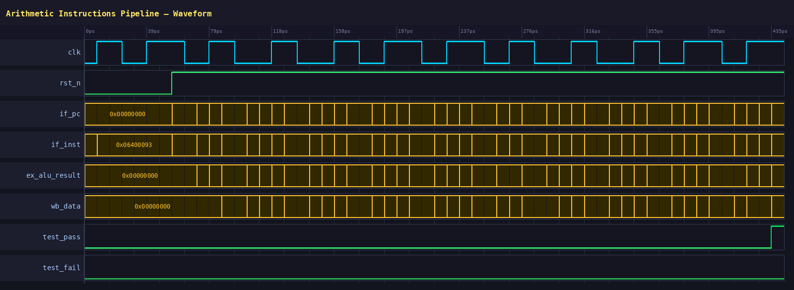
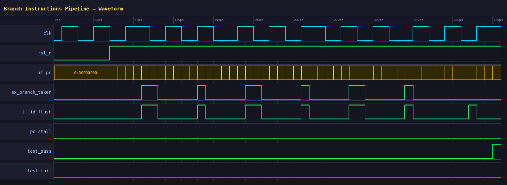
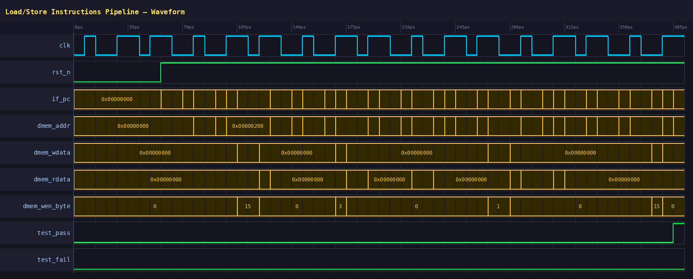
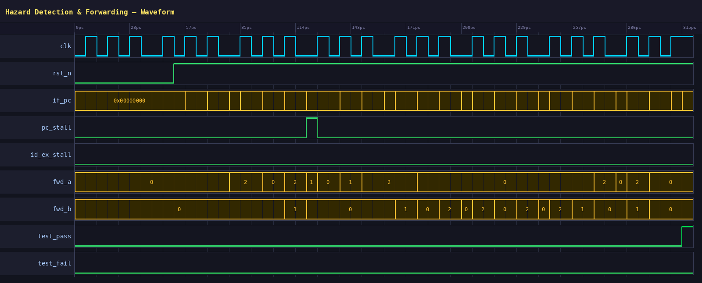
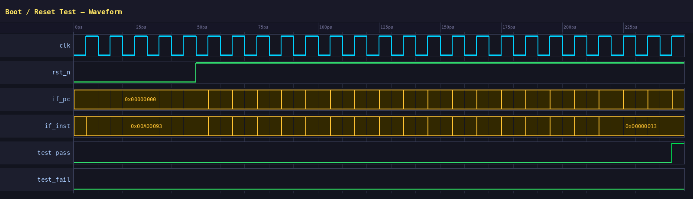

# RISC-V 仿真波形说明

本文档汇总项目各测试的仿真波形截图，波形由 Python 脚本解析 VCD 文件生成（`docs/gen_waveform_images.py`）。

---

## 1. ALU 单元测试

**波形文件：** `alu.vcd`

ALU 模块的单元测试，不含时钟，每个时间步输入一组操作数和操作码：

| 信号 | 说明 |
|------|------|
| `a` / `b` | 32-bit 操作数，覆盖全零、符号数、0xFFFFFFFF 等边界值 |
| `op` | 4-bit 操作码（0=AND, 1=OR, 2=ADD, 3=SUB, …, 10=SRA） |
| `result` | ALU 输出结果，与 `op` 对应，共 11 组操作验证 |

测试覆盖所有 RISC-V RV32I 算术/逻辑操作。

---

## 2. 寄存器堆测试

**波形文件：** `regfile.vcd`

寄存器堆读写功能测试：

| 信号 | 说明 |
|------|------|
| `clk` | 系统时钟（蓝色）|
| `wen` | 写使能，高电平期间写入 `rd_data` |
| `rd_addr` / `rd_data` | 写端口：依次写入 0xDEADBEEF、0x00BADBAD、0x12345678 |
| `rs1_data` / `rs2_data` | 读端口：上升沿后即可读回刚写入的值，验证同步写/异步读 |

波形中可观察到 `wen` 与时钟对齐，写后立刻从读端口读回正确数据。

---

## 3. 算术指令流水线测试

**波形文件：** `arith_test.vcd`

完整五级流水线执行算术指令序列（ADD/SUB/AND/OR/XOR/SLL/SRL/SRA/SLT 等）：

| 信号 | 说明 |
|------|------|
| `clk` / `rst_n` | 复位释放后流水线开始工作 |
| `if_pc` / `if_inst` | 取指阶段 PC 递增，每拍取一条指令 |
| `ex_alu_result` | 执行阶段 ALU 结果随指令变化 |
| `wb_data` | 写回阶段数据，延迟两拍到达 |
| `test_pass` | 最后一拍拉高（绿色上升沿），`test_fail` 全程为低 → **测试通过** |

---

## 4. 分支指令流水线测试

**波形文件：** `branch_test.vcd`

验证 BEQ/BNE/BLT/BGE/BLTU/BGEU 六种分支指令及流水线冲刷：

| 信号 | 说明 |
|------|------|
| `ex_branch_taken` | 分支条件成立时拉高，可见多次规则脉冲 |
| `if_id_flush` | 与 `ex_branch_taken` 同步，冲刷 IF/ID 寄存器消除分支延迟槽错误指令 |
| `pc_stall` | 全程为低，无 PC 暂停（分支采用 flush 而非 stall） |
| `test_pass` | 最终拉高 → **所有分支测试通过** |

---

## 5. Load/Store 指令流水线测试

**波形文件：** `load_store_test.vcd`

验证 LB/LH/LW/LBU/LHU/SB/SH/SW 等存取指令：

| 信号 | 说明 |
|------|------|
| `dmem_addr` | 数据存储器地址，Store 期间输出有效地址（如 0x00000200）|
| `dmem_wdata` | 写数据，Store 指令期间有效 |
| `dmem_rdata` | 读数据，Load 指令期间由存储器返回 |
| `dmem_wen_byte` | 字节写使能：0=无写, 1=SB, 3=SH, 15(0xF)=SW |
| `test_pass` | 最终拉高 → **所有存取测试通过** |

---

## 6. 数据冒险检测与前递测试

**波形文件：** `hazard_test.vcd`

验证数据冒险检测单元（RAW 冒险）的流水线暂停与操作数前递：

| 信号 | 说明 |
|------|------|
| `pc_stall` | Load-Use 冒险时出现一个时钟周期暂停脉冲 |
| `id_ex_stall` | ID/EX 级暂停（与 `pc_stall` 同步）|
| `fwd_a` | rs1 前递选择：0=寄存器堆, 1=MEM 段前递, 2=WB 段前递 |
| `fwd_b` | rs2 前递选择：同上，频繁在 0/1/2 间切换说明连续 RAW 冒险全部通过前递解决 |
| `test_pass` | 最终拉高 → **冒险处理测试通过** |

---

## 7. 启动/复位测试

**波形文件：** `boot_test.vcd`

验证处理器复位后能正确从 0x00000000 启动并执行指令：

| 信号 | 说明 |
|------|------|
| `rst_n` | 复位低电平持续约 40ps 后释放，流水线开始工作 |
| `if_pc` | 复位期间保持 0x00000000，复位释放后正常递增 |
| `if_inst` | 第一条指令 `0x00A00093`（`ADDI x1, x0, 10`），末尾出现 `0x00000013`（NOP）|
| `test_pass` | 最终拉高，`test_fail` 全程为低 → **启动测试通过** |

---

## 总结

| 测试 | 波形文件 | 结果 |
|------|----------|------|
| ALU 单元 | `alu.vcd` | ✓ 11 种操作全部验证 |
| 寄存器堆 | `regfile.vcd` | ✓ 读写功能正常 |
| 算术指令 | `arith_test.vcd` | ✓ test_pass 拉高 |
| 分支指令 | `branch_test.vcd` | ✓ test_pass 拉高 |
| Load/Store | `load_store_test.vcd` | ✓ test_pass 拉高 |
| 冒险检测 | `hazard_test.vcd` | ✓ test_pass 拉高 |
| 启动复位 | `boot_test.vcd` | ✓ test_pass 拉高 |

所有测试均通过（`test_pass=1`, `test_fail=0`），仿真阶段完成。
